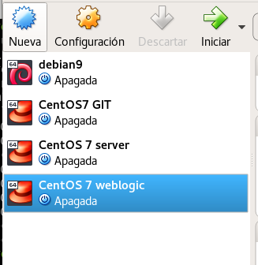
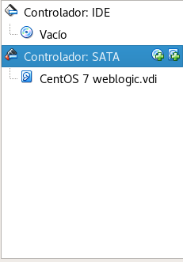
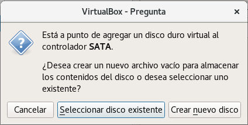
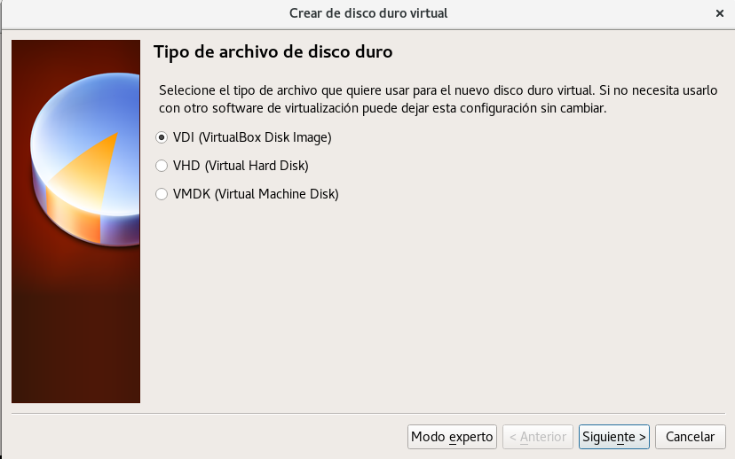
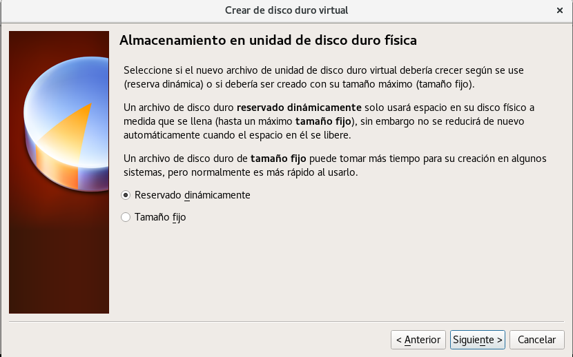

Asignar un nuevo disco a una maquina virtual
=========

- En este caso trabajamos con el hipervisor VirtualBox, por lo que apagamos la máquina y seleccionamos configuración:

- Luego nos vamos a la opción de Almacenamiento y le damos a crear un nuevo disco:

- Nos abre una ventana que a donde seleccionaremos crear nuevo disco:

- Seleccionamos el tipo de archivo en este VDI:

- Luego le decimos que el archivo sea reservado dinamicámente:

