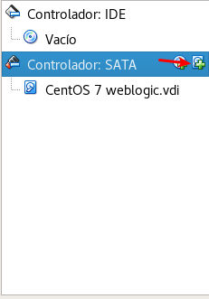
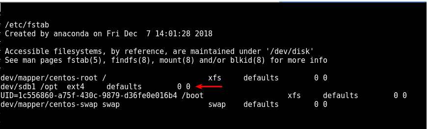

Asignar un nuevo disco a una maquina virtual
=========

- En este caso trabajamos con el hipervisor VirtualBox, por lo que apagamos la máquina y seleccionamos configuración:

- Luego nos vamos a la opción de Almacenamiento y le damos a crear un nuevo disco:

- Nos abre una ventana a donde seleccionaremos crear nuevo disco:

- Seleccionamos el tipo de archivo, en este caso VDI:

- Luego le decimos que el archivo sea reservado dinamicámente:

.. image:: ../imagenes/creardisco/006.png

- Seleccionamos la ubicación del archivo, el nombre, y el tamaño:

- Ya nos debe mostrar el nuevo disco:

- Le damos a aceptar para guardar la nueva configuración y encendemos la máquina:

- Luego dentro del servidor procederemos a particionar y formatear el disco.

- Con el comando fdisk -l listamos los discos que identifica el sistema operativo y se puede observar que el sdb no está particionado::

	#fdisk -l

	Disk /dev/sdb: 32.2 GB, 32212254720 bytes, 62914560 sectors
	Units = sectors of 1 * 512 = 512 bytes
	Sector size (logical/physical): 512 bytes / 512 bytes
	I/O size (minimum/optimal): 512 bytes / 512 bytes

	Disk /dev/sda: 8589 MB, 8589934592 bytes, 16777216 sectors
	Units = sectors of 1 * 512 = 512 bytes
	Sector size (logical/physical): 512 bytes / 512 bytes
	I/O size (minimum/optimal): 512 bytes / 512 bytes
	Disk label type: dos
	Identificador del disco: 0x000cbb9a

	Disposit. Inicio    Comienzo      Fin      Bloques  Id  Sistema
	/dev/sda1   *        2048     2099199     1048576   83  Linux
	/dev/sda2         2099200    16777215     7339008   8e  Linux LVM

	Disk /dev/mapper/centos-root: 6652 MB, 6652166144 bytes, 12992512 sectors
	Units = sectors of 1 * 512 = 512 bytes
	Sector size (logical/physical): 512 bytes / 512 bytes
	I/O size (minimum/optimal): 512 bytes / 512 bytes

	Disk /dev/mapper/centos-swap: 859 MB, 859832320 bytes, 1679360 sectors
	Units = sectors of 1 * 512 = 512 bytes
	Sector size (logical/physical): 512 bytes / 512 bytes
	I/O size (minimum/optimal): 512 bytes / 512 bytes

- Procedemos a particionar el disco sdb con el comando fdisk, pero primero debemos evaluar las opciones del comando::

	# fdisk /dev/sdb
	Welcome to fdisk (util-linux 2.23.2).

	Changes will remain in memory only, until you decide to write them.
	Be careful before using the write command.

	Device does not contain a recognized partition table
	Building a new DOS disklabel with disk identifier 0x9031027e.

	Orden (m para obtener ayuda): m
	Orden  Acción
   	a   toggle a bootable flag
	   b   edit bsd disklabel
	   c   toggle the dos compatibility flag
	   d   delete a partition
	   g   create a new empty GPT partition table
	   G   create an IRIX (SGI) partition table
	   l   list known partition types
	   m   print this menu
	   n   add a new partition
	   o   create a new empty DOS partition table
	   p   print the partition table
	   q   quit without saving changes
	   s   create a new empty Sun disklabel
	   t   change a partition's system id
	   u   change display/entry units
	   v   verify the partition table
	   w   write table to disk and exit
	   x   extra functionality (experts only)

- Colocamos primero la opción "p" para que nos muestra la tabla de particiones, y por ser un disco nuevo no deberíamos tener ninguna::
	
	Orden (m para obtener ayuda): p

	Disk /dev/sdb: 32.2 GB, 32212254720 bytes, 62914560 sectors
	Units = sectors of 1 * 512 = 512 bytes
	Sector size (logical/physical): 512 bytes / 512 bytes
	I/O size (minimum/optimal): 512 bytes / 512 bytes
	Disk label type: dos
	Identificador del disco: 0x9031027e

	Disposit. Inicio    Comienzo      Fin      Bloques  Id  Sistema

- Luego con la opción "n" creamos una nueva partición, y le decimos que sea primaria, y que el primer sector empiece en su valor predeterminado y el último sector termine en el valor predeterminado::

	Orden (m para obtener ayuda): n
	Partition type:
	   p   primary (0 primary, 0 extended, 4 free)
	   e   extended
	Select (default p): p
	Número de partición (1-4, default 1): 
	Primer sector (2048-62914559, valor predeterminado 2048): 
	Se está utilizando el valor predeterminado 2048
	Last sector, +sectors or +size{K,M,G} (2048-62914559, valor predeterminado 62914559): 
	Se está utilizando el valor predeterminado 62914559
	Partition 1 of type Linux and of size 30 GiB is set

- Luego obtenemos la ayuda del comando fdisk y volvemos a imprimir la tabla de particiones y nos debe mostrar la partición creada::

		Orden (m para obtener ayuda): m
	Orden  Acción
	   a   toggle a bootable flag
	   b   edit bsd disklabel
	   c   toggle the dos compatibility flag
	   d   delete a partition
	   g   create a new empty GPT partition table
	   G   create an IRIX (SGI) partition table
	   l   list known partition types
	   m   print this menu
	   n   add a new partition
	   o   create a new empty DOS partition table
	   p   print the partition table
	   q   quit without saving changes
	   s   create a new empty Sun disklabel
	   t   change a partition's system id
	   u   change display/entry units
	   v   verify the partition table
	   w   write table to disk and exit
	   x   extra functionality (experts only)

	Orden (m para obtener ayuda): p

	Disk /dev/sdb: 32.2 GB, 32212254720 bytes, 62914560 sectors
	Units = sectors of 1 * 512 = 512 bytes
	Sector size (logical/physical): 512 bytes / 512 bytes
	I/O size (minimum/optimal): 512 bytes / 512 bytes
	Disk label type: dos
	Identificador del disco: 0x9031027e

	Disposit. Inicio    Comienzo      Fin      Bloques  Id  Sistema
	/dev/sdb1            2048    62914559    31456256   83  Linux

- Con la opción "w" guardamos el cambio en la tabla de particiones::

	
	Orden (m para obtener ayuda): w
	¡Se ha modificado la tabla de particiones!

	Llamando a ioctl() para volver a leer la tabla de particiones.
	Se están sincronizando los discos.

- Colocamos nuevamente el comando fdisk -l y ya nos muestra la partición sdb1::

	# fdisk -l

	Disk /dev/sdb: 32.2 GB, 32212254720 bytes, 62914560 sectors
	Units = sectors of 1 * 512 = 512 bytes
	Sector size (logical/physical): 512 bytes / 512 bytes
	I/O size (minimum/optimal): 512 bytes / 512 bytes
	Disk label type: dos
	Identificador del disco: 0x9031027e

	Disposit. Inicio    Comienzo      Fin      Bloques  Id  Sistema
	/dev/sdb1            2048    62914559    31456256   83  Linux

	Disk /dev/sda: 8589 MB, 8589934592 bytes, 16777216 sectors
	Units = sectors of 1 * 512 = 512 bytes
	Sector size (logical/physical): 512 bytes / 512 bytes
	I/O size (minimum/optimal): 512 bytes / 512 bytes
	Disk label type: dos
	Identificador del disco: 0x000cbb9a

	Disposit. Inicio    Comienzo      Fin      Bloques  Id  Sistema
	/dev/sda1   *        2048     2099199     1048576   83  Linux
	/dev/sda2         2099200    16777215     7339008   8e  Linux LVM

	Disk /dev/mapper/centos-root: 6652 MB, 6652166144 bytes, 12992512 sectors
	Units = sectors of 1 * 512 = 512 bytes
	Sector size (logical/physical): 512 bytes / 512 bytes
	I/O size (minimum/optimal): 512 bytes / 512 bytes

	Disk /dev/mapper/centos-swap: 859 MB, 859832320 bytes, 1679360 sectors
	Units = sectors of 1 * 512 = 512 bytes
	Sector size (logical/physical): 512 bytes / 512 bytes
	I/O size (minimum/optimal): 512 bytes / 512 bytes

- Luego formateamos la partición con el formato ext4::

	# mkfs.ext4 /dev/sdb1
	mke2fs 1.42.9 (28-Dec-2013)
	Etiqueta del sistema de ficheros=
	OS type: Linux
	Tamaño del bloque=4096 (bitácora=2)
	Tamaño del fragmento=4096 (bitácora=2)
	Stride=0 blocks, Stripe width=0 blocks
	1966080 inodes, 7864064 blocks
	393203 blocks (5.00%) reserved for the super user
	Primer bloque de datos=0
	Número máximo de bloques del sistema de ficheros=2155872256
	240 bloque de grupos
	32768 bloques por grupo, 32768 fragmentos por grupo
	8192 nodos-i por grupo
	Respaldo del superbloque guardado en los bloques: 
		32768, 98304, 163840, 229376, 294912, 819200, 884736, 1605632, 2654208, 
		4096000

	Allocating group tables: hecho                           
	Escribiendo las tablas de nodos-i: hecho                           
	Creating journal (32768 blocks): hecho
	Escribiendo superbloques y la información contable del sistema de ficheros: hecho  

- Montamos la partición en el directorio /opt, en este caso porque vamos a montar un servidor de aplicación y queremos aumentar el tamaño de dicho file system::

	# mount /dev/sdb1 /opt/

- Luego con el comando df -h listamos los file systems montados y nos muestra el montado en /opt::

	# df -h
	S.ficheros              Tamaño Usados  Disp Uso% Montado en
	/dev/mapper/centos-root   6,2G   1,2G  5,1G  19% /
	devtmpfs                  485M      0  485M   0% /dev
	tmpfs                     496M      0  496M   0% /dev/shm
	tmpfs                     496M   6,7M  489M   2% /run
	tmpfs                     496M      0  496M   0% /sys/fs/cgroup
	/dev/sda1                1014M   159M  856M  16% /boot
	tmpfs                     100M      0  100M   0% /run/user/1000
	/dev/sdb1                  30G    45M   28G   1% /opt

- Luego debemos editar el /etc/fstab para definar el nuevo file system que queremos que se monte cada vez que inicie el sistema::

	# vi /etc/fstab

-Luego de definido el file system lo volvemos a desmontar, y con el comando mount -a debe montar todos los file systems definidos en el /etc/fstab::

	
	# umount /opt
	# df -h
	S.ficheros              Tamaño Usados  Disp Uso% Montado en
	/dev/mapper/centos-root   6,2G   1,2G  5,1G  19% /
	devtmpfs                  485M      0  485M   0% /dev
	tmpfs                     496M      0  496M   0% /dev/shm
	tmpfs                     496M   6,7M  489M   2% /run
	tmpfs                     496M      0  496M   0% /sys/fs/cgroup
	/dev/sda1                1014M   159M  856M  16% /boot
	tmpfs                     100M      0  100M   0% /run/user/1000

	# mount -a

	# df -h
	S.ficheros              Tamaño Usados  Disp Uso% Montado en
	/dev/mapper/centos-root   6,2G   1,2G  5,1G  19% /
	devtmpfs                  485M      0  485M   0% /dev
	tmpfs                     496M      0  496M   0% /dev/shm
	tmpfs                     496M   6,7M  489M   2% /run
	tmpfs                     496M      0  496M   0% /sys/fs/cgroup
	/dev/sda1                1014M   159M  856M  16% /boot
	tmpfs                     100M      0  100M   0% /run/user/1000
	/dev/sdb1                  30G    45M   28G   1% /opt

