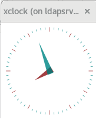

Habilitar Ventanas X en Linux.
========

- Esto es muy util cada vez que se estan realizando instalaciones de productos de terceros, como weblogic de Oracle, en servidores que no poseen entorno grafico, y que solo requerimos que se nos habiliten las ventanas de instalacion.

- Debemos instalar los paquetes necesarios:

  Instalando xorg-x11-server-Xorg.x86_64.::

	# yum -y install xorg-x11-server-Xorg.x86_64
	
  Instalando xorg-x11-xauth.::

	# yum install xorg-x11-xauth

- Luego se debe instalar el paquete que contiene xclock para certificar el funcionamiento de las x. Como no recuerdo el nombre del paquete, hacemos una busqueda y lo instalamos::

	# yum provides '*/xclock'
	Complementos cargados:fastestmirror
	Loading mirror speeds from cached hostfile
	 * base: mirror.uta.edu.ec
	 * extras: mirror.uta.edu.ec
	 * updates: mirror.uta.edu.ec
	base/7/x86_64/filelists_db      | 6.9 MB  00:00:29
	extras/7/x86_64/filelists_db    | 603 kB  00:00:02
	updates/7/x86_64/filelists_db   | 3.2 MB  00:00:15
	xorg-x11-apps-7.7-7.el7.x86_64 : X.Org X11 applications
	Repositorio        : base
	Resultado obtenido desde:
	Nombre del archivo    : /usr/bin/xclock

	# yum install xorg-x11-apps-7.7-7.el7.x86_64

- Seguidamente nos desconectamos de la sesión de ssh que tenemos y debemos hacer la conexion nuevamente con el parametro -X (se debe hacer la conexion con el usuario que queremos ver las ventanas x)::

	# exit
	$ ssh -X root@192.168.1.21
	root@192.168.1.21's password:
	Last login: Wed Oct  3 19:42:07 2018 from 192.168.1.4
	/usr/bin/xauth:  file /root/.Xauthority does not exist
	# echo $DISPLAY
	localhost:10.0

- Finalmente ejecutamos el comando xclock::

	# xclock

- Y nos debe mostrar la ventana del reloj para certificar que las ventanas x estan en funcionamiento:

	

